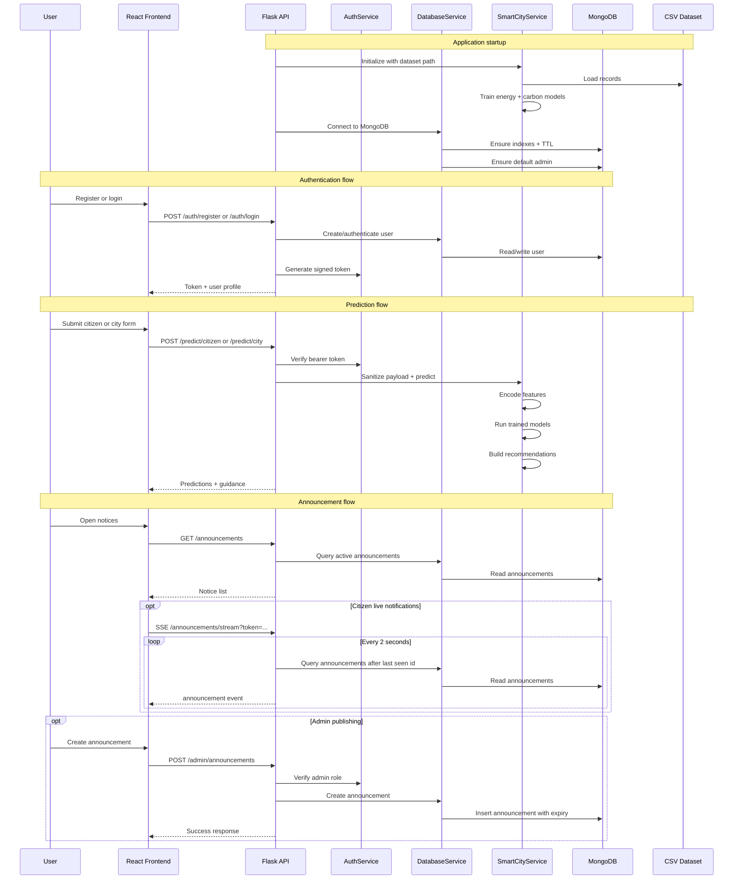

# System Architecture Diagram

This diagram reflects the current implementation in this repository: a React/Vite frontend, a Flask backend, MongoDB persistence, and an in-memory ML pipeline trained from a CSV dataset at application startup.

## High-Level Architecture

```mermaid
flowchart LR
    citizen[Citizen User]
    admin[Admin User]

    subgraph client["Presentation Layer"]
        browser[Web Browser]
        frontend[React + Vite Frontend]
        authctx[AuthContext\nToken + user session]
        dashboard[Dashboard UI\nOverview, guidance, city planning,\nannouncements, users, publish]
        ssehook[Announcement Notification Hook\nEventSource + toast alerts]

        browser --> frontend
        frontend --> authctx
        frontend --> dashboard
        frontend --> ssehook
    end

    subgraph api["Application Layer"]
        flask[Flask App\nrun.py -> create_app()]
        routes[API Blueprints\n/api/v1/*]
        cors[CORS Middleware]
        authsvc[AuthService\nSigned bearer tokens]
        usersvc[UserService]
        annsvc[AnnouncementService]
        repos[Repositories\nUser + Announcement]
        models[Models\nUser + Announcement documents]
        smartsvc[SmartCityService]
        recsvc[Recommendation Module]

        flask --> routes
        flask --> cors
        routes --> authsvc
        routes --> usersvc
        routes --> annsvc
        usersvc --> repos
        annsvc --> repos
        repos --> models
        routes --> smartsvc
        smartsvc --> recsvc
    end

    subgraph ml["Prediction and Analytics Layer"]
        dataset[CSV Dataset\nsmart_city_citizen_activity.csv]
        loader[Dataset Loader\nCSV parsing + category collection]
        encoder[FeatureEncoder\nNormalization + one-hot encoding]
        ridge[Ridge Regressor]
        knn[Weighted KNN Regressor]
        energy[Energy Model]
        carbon[Carbon Model]
        summary[Dashboard Summary Cache]

        dataset --> loader
        loader --> smartsvc
        smartsvc --> encoder
        encoder --> ridge
        encoder --> knn
        ridge --> energy
        knn --> energy
        ridge --> carbon
        knn --> carbon
        smartsvc --> summary
    end

    subgraph data["Data Layer"]
        mongo[(MongoDB)]
        users[(users collection)]
        announcements[(announcements collection)]
        indexes[Indexes + TTL expiry]
        adminseed[Default admin bootstrap]

        mongo --> users
        mongo --> announcements
        repos --> indexes
        usersvc --> adminseed
    end

    citizen --> browser
    admin --> browser

    dashboard -->|REST/JSON| routes
    authctx -->|Login, register, /me| routes
    ssehook -->|SSE /announcements/stream| routes

    authsvc -->|Verify token + roles| usersvc
    repos --> mongo
    repos --> users
    repos --> announcements

    routes -->|Predictions, summary,\nmetadata, recommendations| smartsvc
    routes -->|Registration + login| usersvc
    routes -->|Notices + live stream| annsvc
```

## Runtime Flow



## Component Responsibilities

- `frontend/src/auth/AuthContext.tsx`: manages login state, token persistence, and `/auth/me` bootstrap.
- `frontend/src/features/dashboard/DashboardView.tsx`: main authenticated workspace for citizen and admin flows.
- `frontend/src/hooks/useAnnouncementNotifications.ts`: subscribes citizens to live announcement updates over Server-Sent Events.
- `app/api/v1/`: exposes REST endpoints as one blueprint per resource, including the SSE announcement stream in `announcements.py`.
- `app/core/security.py`: extracts the bearer token, loads the caller, and enforces role-based access via `login_required`.
- `app/services/auth_service.py`: signs and verifies bearer tokens.
- `app/models/`: the database design - `User`/`UserProfile` and `Announcement`/`AnnouncementAuthor` define the document shape and own password hashing and serialisation.
- `app/repositories/`: the only layer that issues MongoDB queries; translates documents to and from the model classes.
- `app/database/`: owns the MongoDB connection plus index and TTL definitions.
- `app/services/user_service.py`: registration validation, authentication, and default admin seeding.
- `app/services/announcement_service.py`: audience validation, city targeting, and expiry cleanup.
- `app/services/smart_city_service.py`: loads the dataset, trains in-memory models, produces predictions, and aggregates dashboard metrics.
- `app/ml/`: feature encoding, ridge regression, weighted KNN, evaluation metrics, and model selection by RMSE.
- `app/services/recommendation_service.py`: converts prediction outputs into citizen guidance and city-level actions.

## Architecture Notes

- The backend is a single deployable Flask process that combines API delivery, authentication, ML inference, and SSE streaming.
- ML models are trained in memory during application startup, not served by a separate model service.
- MongoDB is used only for operational data such as users and announcements; the training dataset remains a CSV file outside the database.
- Announcement expiry is handled with MongoDB TTL indexes plus explicit cleanup calls in the service layer.
- The frontend communicates with the backend through JSON over HTTP, with SSE used only for live citizen announcement notifications.
